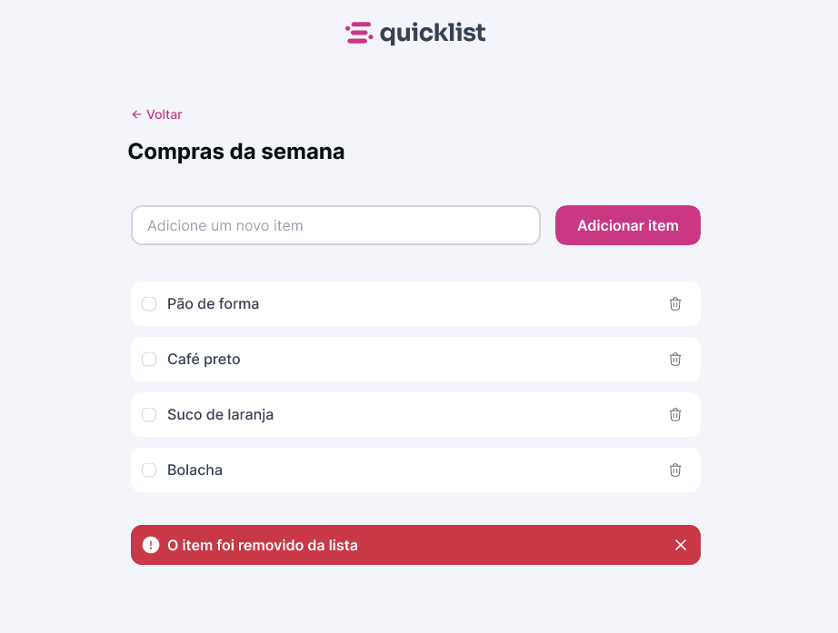

<h1> 🚀 Desafio prático - App de lista de compras</h1>

    

## ✨ Tecnologias

Esse projeto foi desenvolvido com as seguintes tecnologias:

- HTML e CSS
- JavaScript
- Git e Github
- Figma

## 💥 Funcionalidades

- **Adicionar** um item a lista de compras
- **Remover** um item da lista de compras (somente se o item estiver selecionado)
- Impedir o envio de campos de input vazios.

## 💡 Objetivo

Este projeto teve como foco o aprimoramento das habilidades de manipulação da DOM, criação de funções e gerenciamento de eventos no JavaScript.

## 💻 Projeto

Trata-se de uma aplicação web simples de lista de compras, desenvolvida como desafio prático durante o curso Fullstack da Rocketseat na aula de JavaScript básico. 
Fui responsável por toda a implementação, aplicando na prática os conceitos e técnicas aprendidas ao longo das aulas.
